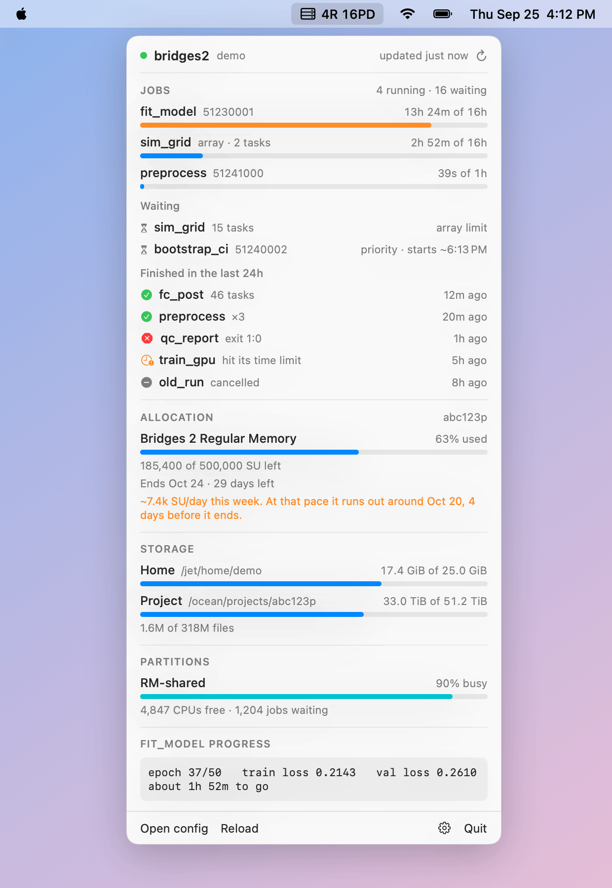

# SlurmBar

Your Slurm jobs in the macOS menu bar. See what's running and how close each job is to its time limit, what finished or failed, how much of your allocation is left, and get a notification when a job ends.

<picture>
  <source media="(prefers-color-scheme: dark)" srcset="assets/showcase-dark.png">
  
</picture>

It works with any Slurm cluster you can reach over ssh. On PSC's Bridges-2 it also shows your SU balance and disk quotas. The screenshot uses made-up data.

## What it shows

- Menu bar (with automatic refresh on): running and waiting job counts, like `4R 16PD`, plus `✗1` when a job failed since you last looked.
- Jobs: running jobs with time used against the time limit (orange past 75%, red past 90%), waiting jobs with the reason and Slurm's start estimate, and jobs that finished in the last 24 hours. Array tasks fold into one row.
- Notifications (with automatic refresh on) when a job finishes, fails, runs out of memory or hits its time limit. A finished array sends a single notification for all its tasks.
- Allocation (PSC): SU left, the end date, and how fast the balance went down this week. If it would run out before the end date at that pace, the panel says when.
- Storage (PSC): home and project quotas, with file counts.
- Partitions: how busy a partition is and how many jobs are waiting for it.
- Anything else: a `command` panel runs a command of your choice on the cluster and shows what it prints.

## Install

SlurmBar is a small SwiftUI app for macOS 14 or later. It builds with the Xcode command line tools alone (`xcode-select --install`), no Xcode needed.

```bash
git clone https://github.com/yuchengwang-stat/slurmbar
cd slurmbar
scripts/build-app.sh
cp -R build/SlurmBar.app /Applications/
```

Open it and a server icon appears in the menu bar, and SlurmBar's icon appears in the Dock. The first time, a window asks for your login host and username. Clicking the Dock icon, or opening SlurmBar again from Finder or Spotlight, brings up the same panel in a window, which helps on a MacBook where a full menu bar pushes the icon behind the notch. Show in Dock in the gear menu turns the Dock icon off. The build is signed ad hoc and not notarized, which is fine for an app you built yourself.

## Connecting

SlurmBar never asks for your password. It runs the system `ssh` with `BatchMode=yes`, so a login that needs a password or 2FA fails instead of prompting, and it joins an ssh connection you opened yourself through a control socket.

When it isn't connected, the panel shows a Connect in Terminal button. That opens Terminal with a command like this, and you sign in there as usual:

```bash
ssh -fN -o ControlMaster=yes -o ControlPath='~/.ssh/slurmbar-%r@%h' -o ControlPersist=12h you@bridges2.psc.edu
```

SlurmBar picks the connection up within a few seconds. Note that `ControlPersist` is an idle timeout: while SlurmBar keeps polling, the connection stays open until you close it (`ssh -O exit` with the same `ControlPath`), the network drops, or the Mac sleeps. The gear menu has an Open at login switch.

With a `controlPath`, SlurmBar can only join that connection. If it's gone, ssh fails at once instead of trying to log in, so a closed laptop lid or a dropped network never turns into a stream of failed logins on the cluster.

If you log in with a key and no 2FA, leave `controlPath` out and SlurmBar connects directly. If such a login is ever refused, it stops trying until you press refresh.

## Refreshing

By default SlurmBar never asks the cluster on its own. Open the panel and press Refresh. If your ssh connection is still open, it refreshes right away. If it isn't, the button reads Log in & refresh: it opens Terminal so you can sign in, and refreshes once you're in. Opening the panel only checks the local ssh socket, which doesn't reach the cluster.

Turn on Refresh automatically in the gear menu (or set `"autoRefresh": true`) to get the menu bar counts and job notifications. SlurmBar then asks as little as it can, since Slurm's own [squeue documentation](https://slurm.schedmd.com/squeue.html) asks programs to keep calls to the minimum necessary:

- `squeue` for your jobs: every 5 minutes while you have jobs in the queue, every 15 minutes when you don't.
- `sacct`: only when a job leaves the queue, to learn how it ended, or when you open the panel and the list is more than 2 minutes old.
- `projects` and `my_quotas`: once an hour, which is enough to work out the allocation pace.
- Partition load lists the whole partition queue, so it only runs while the panel is open, at most every 10 minutes.
- Nothing runs while the screen is locked or asleep. Afterwards SlurmBar checks once, and jobs that ended in the meantime still get their notification.

A day with jobs in the queue and the screen on for 10 hours comes to about 120 `squeue` calls, with `sacct` only as often as jobs end or you open the panel. Every panel takes a `refreshSeconds`, but never below a minute. To see exactly what SlurmBar runs, start it with `SLURMBAR_LOG` set to a file path and every command is logged there with a timestamp.

## Configuration

The config is `~/.config/slurmbar/config.json`, or the file `SLURMBAR_CONFIG` points to. Open config in the panel opens it, and Reload applies your changes. [`examples/bridges2.json`](examples/bridges2.json) is a full example.

At the top level, `autoRefresh` (default `false`) switches on background refresh, `notifications` (default `true`) only matters when it's on, and `showInDock` (default `true`) controls the Dock icon.

```json
{
  "autoRefresh": false,
  "clusters": [
    {
      "name": "bridges2",
      "host": "bridges2.psc.edu",
      "user": "you",
      "controlPath": "~/.ssh/slurmbar-%r@%h",
      "widgets": [
        { "type": "jobs" },
        { "type": "allocation" },
        { "type": "quota" },
        { "type": "partition", "options": { "partitions": "RM-shared" } },
        { "type": "command", "title": "Training loss", "command": "tail -n 3 ~/run/log.txt" }
      ]
    }
  ]
}
```

Cluster fields:

| Field | Meaning |
|---|---|
| `name` | Label in the panel |
| `host`, `user` | Where to ssh |
| `controlPath` | Socket of the connection you open yourself. Leave it out if ssh logs in without a password. |
| `controlPersist` | Used in the connect command SlurmBar suggests. Default `12h`. |
| `sshOptions` | Extra ssh arguments, for example `["-p", "2222"]` |
| `refreshSeconds` | A fixed interval for the jobs panel. Left out, it adapts as described above. |
| `widgets` | The panels, top to bottom |

List several clusters and each gets its own section.

Panels:

| `type` | Shows | Options |
|---|---|---|
| `jobs` | Running, waiting and finished jobs. Drives the notifications and the menu bar count. | `finishedHours` (default 24) |
| `allocation` | SU balance, end date and pace, from PSC's `projects --format json` | `project` to pick one, `storage: "true"` to list storage allocations too |
| `quota` | Disk quotas from PSC's `my_quotas` | |
| `partition` | Load and queue length | `partitions`, comma separated |
| `command` | Whatever the command prints | `lines` (default 6) |

Every panel also takes `title`, `refreshSeconds` and `menuBar` (`true` puts its short summary in the menu bar; for `allocation` that is the share of SUs left). A `command` panel refreshes only while the panel is open, unless it has `refreshSeconds` or `menuBar`. `allocation`, `quota` and `command` take a `command` too, so a panel can read another tool that prints the same format.

## Adding a panel

Most additions need no code. If a shell command can print it, a `command` panel shows it.

For a panel with its own layout, write a class that conforms to `ClusterWidget` and add one line to `WidgetFactory` in `Sources/SlurmBar/Widgets.swift`. `QuotaWidget.swift` is a short one to copy: it runs a command, parses the output, and draws rows. Parsers go in `SlurmBarCore`, which has no UI code, so they can be tested from the command line.

## Development

```bash
swift run slurmbar-check                     # parser checks against made-up cluster output
SLURMBAR_CONFIG=~/my.json swift run slurmbar-check --live   # what SlurmBar would show for your clusters
swift run SlurmBar --demo                    # the app with made-up data, no cluster needed
scripts/render-images.sh                     # redraw the README images and the icon
```

## License

MIT
